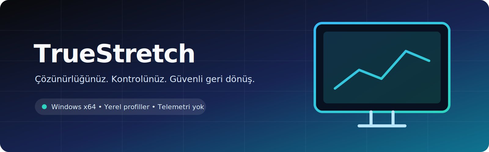

<div align="center">



# TrueStretch

**Windows için güvenli ekran modu, özel çözünürlük profili ve rekabetçi oyun çözünürlüğü öneri aracı.**


[](https://github.com/KayaJR356/TrueStretch/actions/workflows/build.yml)
[](https://github.com/KayaJR356/TrueStretch/releases)
[](LICENSE)
[](https://github.com/KayaJR356/TrueStretch/stargazers)
[](https://github.com/KayaJR356/TrueStretch/forks)
[](https://github.com/KayaJR356/TrueStretch/issues)
[](https://github.com/KayaJR356/TrueStretch/commits/main)
[](TrueStretch.cs)

[Özellikler](#-özellikler) · [Kurulum](#-kurulum) · [Kullanım](#-kullanım) · [Katkı](#-katkı-sağlama) · [Güvenlik](SECURITY.md)

</div>

> [!WARNING]
> Ekran modu değişiklikleri geçici görüntü kaybına yol açabilir. TrueStretch modu önce sürücüyle test eder ve kullanıcı 15 saniye içinde onaylamazsa önceki moda döner. Uygulama imzasızdır; yalnızca bu depodan derlediğiniz veya doğrulanmış bir Release çıktısını kullanın.

## İçindekiler

- [Neden TrueStretch?](#neden-truestretch)
- [Özellikler](#-özellikler)
- [Demo](#-demo)
- [Kurulum](#-kurulum)
- [Kullanım](#-kullanım)
- [Proje yapısı](#-proje-yapısı)
- [Teknoloji yığını](#-teknoloji-yığını)
- [Yol haritası](#-yol-haritası)
- [Katkı sağlama](#-katkı-sağlama)
- [Lisans](#-lisans)
- [İletişim](#-iletişim)
- [Teşekkürler](#-teşekkürler)

## Neden TrueStretch?

TrueStretch, Windows sürücüsünün bildirdiği ekran modlarını tek bir arayüzde yönetir. Yeni modu uygulamadan önce uyumluluğu sınar, geri sayımlı onay sunar ve özel profilleri yerel olarak saklar. Rekabetçi oyunlar için web kaynaklı çözünürlükleri keşfetmeye yardımcı olur; donanım zamanlamasını veya EDID verisini zorla değiştirmez.

## ✨ Özellikler

| Alan | Yetenek |
| --- | --- |
| Güvenli mod değişimi | Modu `CDS_TEST` ile doğrular, 15 saniyede onaylanmazsa geri alır |
| Ekran modu keşfi | Windows sürücüsünün bildirdiği çözünürlük ve yenileme hızlarını listeler |
| Stretch ölçekleme | Sürücü desteklediğinde `DMDFO_STRETCH` ile tam ekran ölçekleme ister |
| Özel profiller | Genişlik, yükseklik ve yenileme hızı profillerini kullanıcı bazında saklar |
| Oyun önerileri | Sekiz rekabetçi oyun için web kaynaklı çözünürlükleri sıralar |
| Çevrimdışı kullanım | Web erişimi olmadığında yerel başlangıç önerilerine döner |
| Gizlilik | Telemetri veya kullanıcı hesabı kullanmaz |
| Taşınabilir çıktı | Kurulum gerektirmeyen tek dosyalık Windows x64 uygulaması üretir |

## 🎬 Demo

- **İndirilebilir sürüm:** [GitHub Releases](https://github.com/KayaJR356/TrueStretch/releases)
- Masaüstü uygulaması olduğu için web demosu bulunmaz.

## 🚀 Kurulum

### Gereksinimler

- Windows 10 veya Windows 11 (64-bit)
- .NET Framework 4.x
- Ekran modu uygulamak için yönetici yetkisi
- Oyun önerileri için isteğe bağlı internet bağlantısı

### Kaynaktan derleme

```powershell
git clone https://github.com/KayaJR356/TrueStretch.git
cd TrueStretch
.\build.ps1
```

Derleme betiği Windows ile gelen 64-bit .NET Framework C# derleyicisini kullanır. Çıktı, betiğin tanımladığı `outputs\TrueStretch.exe` konumuna yazılır.

> [!TIP]
> Bir Release mevcutsa, indirdiğiniz çalıştırılabilir dosyanın yayımlanan SHA-256 değerini doğrulayın.

## 🧭 Kullanım

1. TrueStretch'i yönetici olarak çalıştırın.
2. **Ekran Modları** bölümünde sürücünün sunduğu modu seçin.
3. Modu uygulayın ve görüntü doğruysa 15 saniye içinde onaylayın.
4. Tekrar kullanacağınız değerleri **Özel Profiller** bölümünde kaydedin.
5. Topluluk eğilimlerini görmek için **Oyun Önerileri** bölümünden oyun seçin.
6. Başlangıç ayarına dönmek için **Başlangıç moduna dön** seçeneğini kullanın.

> [!CAUTION]
> Web önerileri teknik uyumluluk garantisi değildir. Desteklenen gerçek modları ekranınız ve GPU sürücünüz belirler. Ekran ayarı değiştirmeden önce açık çalışmalarınızı kaydedin.

Profiller şurada tutulur:

```text
%LocalAppData%\TrueStretch\profiles.xml
```

## 🗂️ Proje yapısı

```text
TrueStretch/
├── .github/
│   ├── ISSUE_TEMPLATE/
│   └── workflows/build.yml
├── assets/
│   └── TrueStretch.ico
├── docs/
│   └── ARCHITECTURE.md
├── TrueStretch.cs
├── app.manifest
├── build.ps1
├── README.md
├── LICENSE
└── CHANGELOG.md
```

> [!NOTE]
> Bu özet yalnızca README ve derleme yapılandırmasında doğrulanan ana dosyaları gösterir.

## 🧰 Teknoloji yığını

| Katman | Teknoloji |
| --- | --- |
| Dil | C# |
| Arayüz | Windows Forms |
| Platform | .NET Framework 4.x / Windows x64 |
| Ekran API'leri | Win32: `EnumDisplaySettings`, `ChangeDisplaySettingsEx` |
| Aygıt yönetimi | Configuration Manager API (`cfgmgr32.dll`) |
| Veri | Yerel XML |
| Web araması | HTTPS üzerinden Bing RSS |
| CI | GitHub Actions |
| Harici paket | Yok |

Mimari ayrıntıları için [docs/ARCHITECTURE.md](docs/ARCHITECTURE.md) dosyasına bakın.

## 🗺️ Yol haritası

- [x] Güvenli ekran modu listeleme ve uygulama
- [x] 15 saniyelik otomatik geri alma
- [x] Yerel özel çözünürlük profilleri
- [x] Oyun çözünürlüğü önerileri
- [ ] Birden fazla monitör seçimi
- [ ] Kod imzalı sürümler
- [ ] Yerelleştirme kaynakları
- [ ] Öneri kaynakları için alan adı filtreleme ve güven puanı
- [ ] İsteğe bağlı üretici API modülleri

Öneriler için [feature request](https://github.com/KayaJR356/TrueStretch/issues/new?template=feature_request.md) açabilirsiniz.

## 🤝 Katkı sağlama

Katkılar memnuniyetle karşılanır:

1. Önce mevcut issue'ları kontrol edin.
2. Anlamlı değişiklikler için bir issue açın.
3. Depoyu fork edin ve odaklı bir dal oluşturun.
4. `.\build.ps1` ile temiz derlemeyi doğrulayın.
5. Açıklayıcı bir pull request gönderin.

Ayrıntılar için [CONTRIBUTING.md](CONTRIBUTING.md), davranış standartları için [CODE_OF_CONDUCT.md](CODE_OF_CONDUCT.md) dosyasını okuyun.

## 📄 Lisans

Bu proje [MIT Lisansı](LICENSE) altında sunulur.

## 📬 İletişim

- Hata bildirimi: [GitHub Issues](https://github.com/KayaJR356/TrueStretch/issues)
- Güvenlik açığı: [SECURITY.md](SECURITY.md)
- Genel destek: [SUPPORT.md](SUPPORT.md)

## 🙏 Teşekkürler

- Katkıda bulunan ve geri bildirim paylaşan topluluk üyelerine
- .NET ve Windows geliştirici ekosistemine
- Açık kaynak araçlarını sürdüren herkese

---

<div align="center">
TrueStretch'i yararlı bulduysanız projeye ⭐ vermeyi düşünebilirsiniz.
</div>
